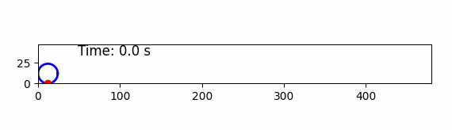

# Отчет о программе для визуализации движения точки на ободе колеса
[Ссылка на exe-файл с программой](https://drive.google.com/drive/folders/1_e-6vHKcdzgju_ISZLFaMqn0Q1zW0vU_?usp=sharing)

## Введение
Данная программа предназначена для визуализации движения точки, расположенной на ободе вращающегося колеса. Она использует математическую модель, описывающую циклоидальную траекторию, которую описывает точка на колесе в процессе его катания. Программа написана на языке Python с использованием библиотек NumPy и Matplotlib.

## Входные параметры
Пользователь вводит следующие параметры:
- **Радиус колеса (R)**: Определяет размер колеса.
- **Скорость центра масс колеса (v)**: Устанавливает скорость, с которой колесо катится по горизонтальной поверхности.
## Описание работы программы
1. **Моделирование движения**: Программа вычисляет частоту вращения колеса, используя формулу \(\omega = \frac{v}{R}\). Затем создается последовательность временных интервалов для анимации.
2. **Создание графиков**: Используется `matplotlib` для создания графического интерфейса, где отображаются:
   - Траектория движения точки на ободе колеса (циклоид).
   - Вращающееся колесо.
   - Точка, движущаяся по ободу колеса.
   - Таймер, показывающий время, прошедшее с начала анимации.

## Результаты
По завершении анимации пользователь видит:
- Динамическое отображение движения колеса.
- Постепенно строящуюся траекторию точки, которая движется по циклоиде.
- Визуализацию времени, прошедшего с начала анимации.

## Пример итоговой анимации

